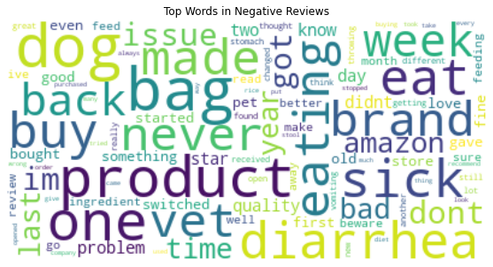

# Dog Food Reviews Analysis


## Introduction
The task involves analyzing data collected from a pet food company known for its dog food products. This project aims to leverage the power of Natural Language Processing (NLP) to analyze customer reviews of a well-known dog food product.

## Business Problem
The project addresses the challenge of understanding customer feedback in the pet food industry, focusing on a well-established dog food company. As the market grows increasingly competitive, it is crucial for the company to stay attuned to customer preferences and feedback. By analyzing customer reviews through text classification, the company can categorize feedback into complaints and praise, enabling a more nuanced understanding of customer needs and preferences.

## Data
File was sourced from [Kaggle](https://www.kaggle.com/datasets/unwrangle/amazon-reviews-for-dog-food-product) it includes 4605 reviews for a high quality dog food product on Amazon.

Each row in the DataFrame represents a single review and includes various details such as:

- **Total Ratings**: The total number of ratings for the product.
- **Total Reviews**: The total number of reviews.
- **Rating**: The rating given by the author.
- **Review Title**: The title of the review.
- **Review Text**: The text content of the review.
- **Verified Purchase**: Whether the purchase was verified or not.

## Approach
1. **Preprocessing**: 
   - Clean and normalize review texts.
   - Tokenize the text into individual words or tokens.
2. **Feature Extraction**: 
   - Employ techniques like bag-of-words or TF-IDF to convert text data into a machine learning-friendly format.
3. **Labeling Data**: 
   - Categorize a subset of reviews manually to create a labeled dataset for training.
4. **Model Training**: 
   - Use algorithms like Logestic Regression, Random Forest, and Support Vector Machines for text classification.
5. **Model Evaluation**: 
   - Assess model performance using metrics such as accuracy, precision, recall, and F1-score.

## Insights
The sentiment analysis provided a clear insights into customer preferences and areas for product and service enhancement. Positive sentiments frequently revolved around words like `'love', 'great', and 'healthy'`, whereas negative sentiments often included words such as `'sick', 'bad', and 'never'`.




### Recommendations:
1. **Product Improvement**: Addressing the issues highlighted in negative feedback and leveraging positive feedback in product innovation.
2. **Marketing Strategies**: Using the insights gained to shape marketing campaigns and public communications.
3. **Quality Assurance**: Enhancing quality checks and establishing a customer feedback loop for continuous improvement.

## Next Steps
- **Expand Data Collection**: Integrating more data sources to enrich the analysis.
- **Real-Time Analysis**: Setting up a system for ongoing, real-time sentiment analysis.

## Conclusion
The project demonstrates the practical application of machine learning in understanding customer sentiment and provides a roadmap for maintaining product excellence in a competitive market.


For a more detailed and technical explanation of the project, please refer to the full project report.
Please view full analysis in [Jupyter Notebook](https://github.com/nv593/Dog-Food-Analysis/blob/main/dog_food_reviews.ipynb) or [Presentation](https://github.com/nv593/Dog-Food-Analysis/blob/main/Dod_Food_Reviews.pdf)

#### Repository Structure

```
├── data
├── visualizations
├── Dog_Food_Reviews.pdf
├── README.md
├── dog_food_reviews.ipynb
